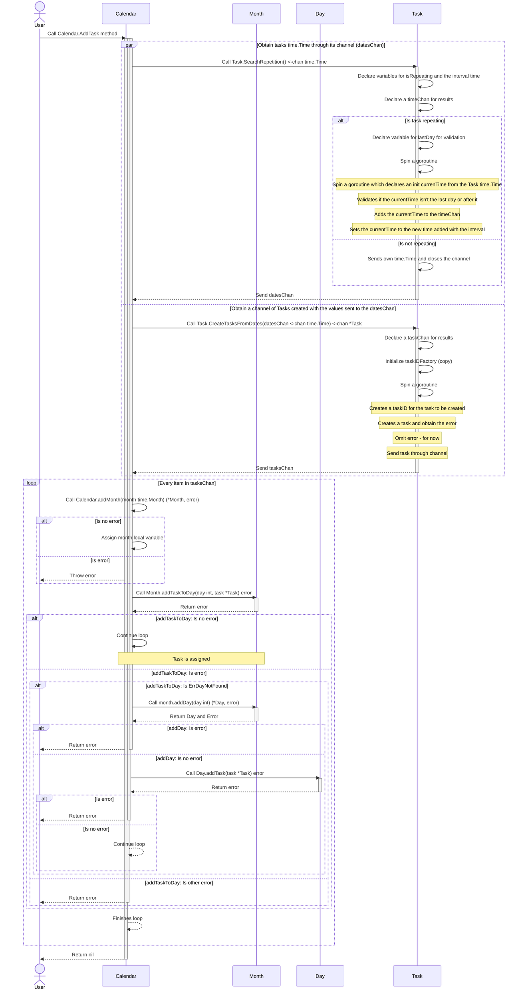

# Go Calendar

# WIP

* Task repetition logic, how do the task repeat and persist through an application?
    * How can I identify which task is the origin and which are replicated?
        - Compound:ID. Make unique ID identifier for tasks.
        - task_id-<serial-number>-o / task_id-<serial-number>-c
        - only save tasks completed to the db, by default uncompleted without draft state will be generated on runtime.
        - Task's global state will be cached. 
    * How can I mutate all of them? How can I distiguish them even when they are the same?

# Calendar Sequence Diagrams

## Create Task

